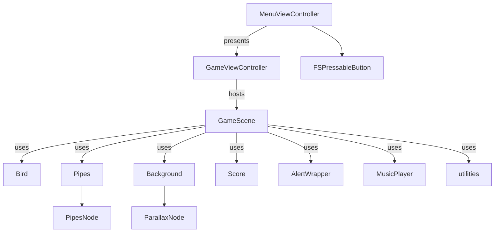

# FlappySwift

> This project is the one that started my career in Swift and as a book author. — Gio Scalzo

FlappySwift is a modern, clean, and modular implementation of the classic Flappy Bird game, written entirely in Swift. It was the foundation for my journey into iOS development and technical writing.

## 📽️ Demo Video

---

## 🗂️ Module Diagram

---

## 📝 About

- **Author:** Gi Scalzo
- **Original Year:** 2014
- **Renewed Year:** 2025
- **Language:** Swift
- **License:** MIT

This codebase is a great starting point for learning SpriteKit, game architecture, and modular Swift design. Enjoy hacking and flying! 